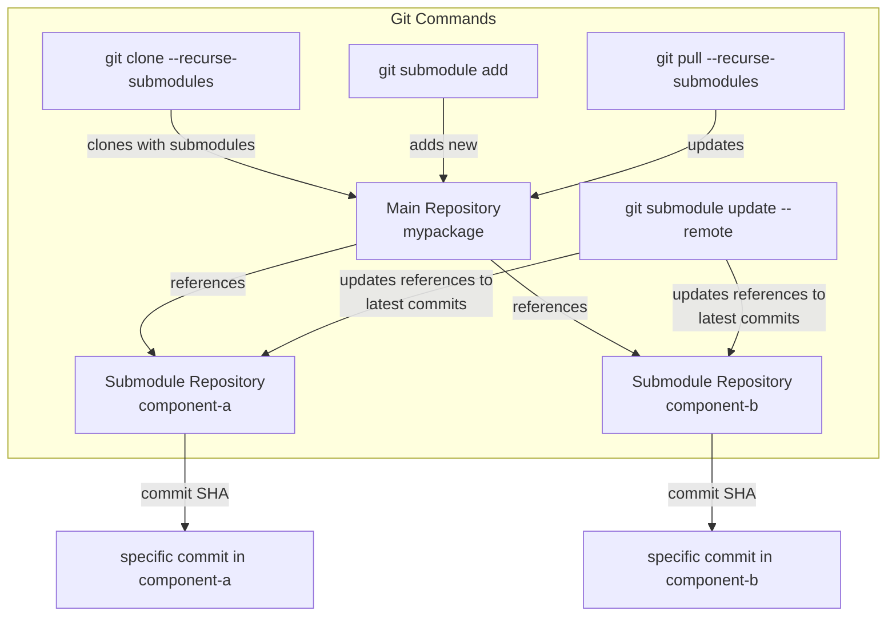

# This Repo is used for demo submodule repo + github template

Folder structure
```
mypackage
│   .gitmodules
│   pyproject.toml
│   README.md
└───src
    └───mypackage
        │
        └───components
            │
            ├───component-a (submodule)
            │
            └───component-b (submodule)
```

Study on gitsubmodule: https://git-scm.com/book/en/v2/Git-Tools-Submodules

How to clone for Repo with submodules
```shell
git clone --recurse-submodules https://github.com/linnkern/mypackage.git
```

How to add new component as submodule
```shell
git submodule add <gitthub repo url> <directory>
git submodule init # You will see there is .gitmodules file, submodule details will be added in .gitsubmodule
```

How to pull for Repo with submodules
```shell
git pull --recurse-submodules
```

How to update submodules
```shell
git submodule update --remote
```

How to remove submodule from repo
```shell
git submodule deinit -f <submodule paht>
rm -Force .git\modules\<submodule path>
git rm -f <submodule path>
```

How to turn a submodule into a directory
```shell
git rm --cached <submodule path>
git rm .gitmodules # Remove manually if you have multiple submodules
rm -rf ./<submodule directory>/.git
```

Summary of submodule commands

